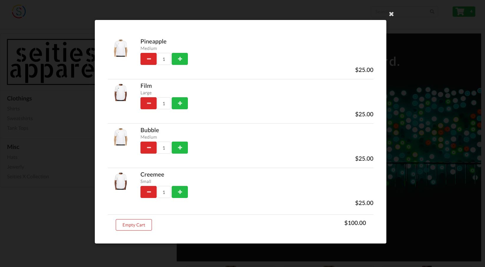
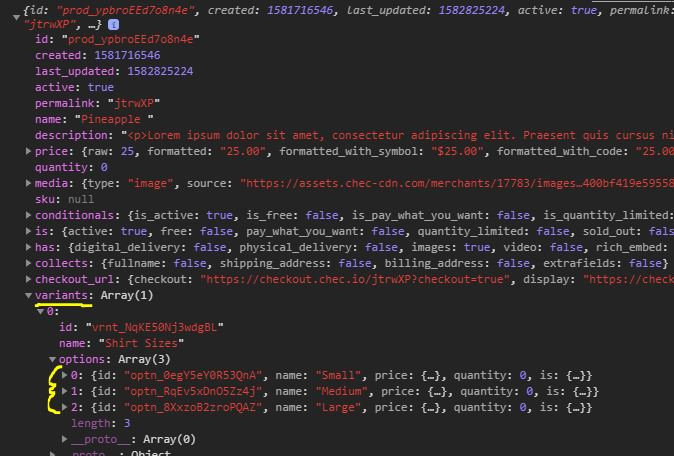
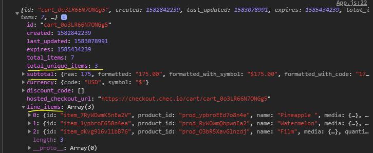
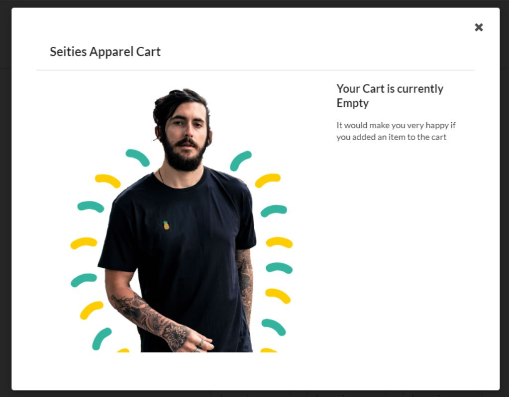
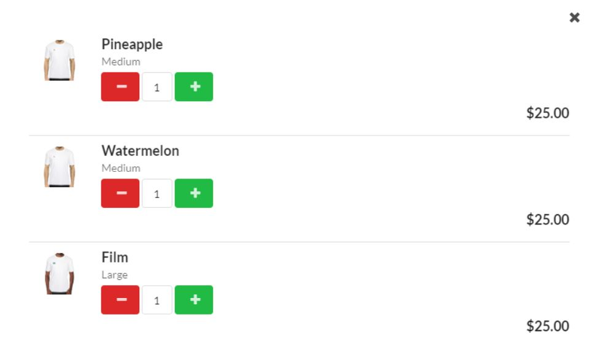

# Adding products to your cart using Commerce.js (SDK) and React.js

This guide illustrates how to add products to your cart using React.js & Commerce.js (SDK)

[See live demo here.](https://seities-store-cjs-react-guide.netlify.com/)

****** *Note* ******

* *This guide is using v2 of the SDK*
* *The Live Demo is best viewed on Desktop (**responsiveness limited**)*
* *This is a continuation of a previous guide - [Listing Products in Catalog](https://github.com/kingmoc/product-list-cjs-react)*

**********



## Overview
Okay! So you've been working hard adding all your wonderful products to your Chec Dashboard.  Now it's time to give the user the ability to add those products to the cart.  This process involves a few more steps but don't worry - this guide has you covered! One of the biggest advantages of using the Commerce.js (SDK) is that the commerce object has easy to implement functions that help with building out the cart functionality.  Further and most importantly, every cart method such as `cart.add()`, `cart.retrieve()`, `cart.update()` return an updated cart object which helps keep our cart updated and persistent through a refresh.  Now, let's dive in!

#### This guide will cover: 

1. Setting up variants and handling that in code 
2. The process to add a product to your cart 
3. Making sure to give cart update notification to user 
4. Listing items that have been added to cart 
5. Adding a button to empty entire cart 
6. Capability to increase/decrease quantity from within cart

*This guide strictly utilizes functional react components and relies heavenly on react hooks.  The purpose of this guide is to show how you can use the SDK to build eCommerce functionality and not a true deep dive into react. There will be links to outside resources that can further explain certain react features.*

### Requirements/Prerequisites

- [ ] IDE of your choice (code editor)
- [ ] [NodeJS](https://nodejs.org/en/), or [yarn](https://classic.yarnpkg.com/en/docs/install/#windows-stable) → npm or yarn.
- [ ] Some knowledge of Javascript & React
- [ ] *Bonus* - Using [React Hooks](https://reactjs.org/docs/hooks-reference.html) - specifically `useState()`, `useEffect()`, `useContext()`
- [ ] *Bonus* - familiarity with the framework [Semantic UI (react) library](https://react.semantic-ui.com/)

## Getting Started

### STEP 1. Adding Variants:

This step is important when having products with some sort of variance.  If you have a product without variances, you can proceed to Step 2. - otherwise you need to add product variances in your Chec dashboard.  In our example store selling t-shirts most likely you'll have different sizes and colors.  To keep it simple we will be providing options of **Small, Medium, Large**. Once you click on a product, select the options tab ...   


It's important to note that you shouldn't add a price in this section unless a particular variant yields an increase in price. So in our case no matter which size you select, the price remains $25. Save those changes and let's see how we can handle this in our code! 

#### Handling Variants in the code

The Product object has a property *variants* which is an array with each product variant.  Also within each variant is another property *options* which is also an array with each variant options (ex. Small, Medium etc...) 



We can handle this data in our `<ProuductCard />` component where we are currently displaying product info. You can display the options how you like but our example will use a drop-down. Because of how drop-downs are configured with Semantic UI - we have to provide an options array of objects with a certain format. 

```javascript
// *** ProductCard.js ***

    useEffect(() => {        
        
        let finalSizeArray = props.product.variants[0].options.map(option => {
            let sizeInfo = {}

            sizeInfo.key = option.name
            sizeInfo.text = option.name
            sizeInfo.value = option.id

            return sizeInfo
        })

        setSizes(finalSizeArray)
    }, [])
```

The purpose of the `useEffect()` here is that our `<Dropdown />` Semantic UI component needs options to select.  The `useEffect()` allows us to map through our variant options and create our options array before the render.  It's important to note I set the value to the option.id because that is important information needed to add a product (and it's variant) to the cart.  Once complete, we add that value to state so our `<Dropdown />`  component can then access it.  

```
const [sizes, setSizes] = useState([])
```

This is how our Product Card looks once we add our dropdown: 

```javascript
// *** ProductCard.js ***

<Card>
    <Image src={props.product.media.source} />
    <Card.Content>
        <Card.Header>{props.product.name}</Card.Header>
        <Card.Meta>{props.product.price.formatted_with_symbol}</Card.Meta>
        <Card.Description>{props.product.description.replace(/(<([^>]+)>)/ig,"")}</Card.Description>
        <Dropdown
            className="sizes-drop"
            onChange={handleSize}
            value={sizes.text}
            fluid
            placeholder='Select Size'
            selection
            options={sizes}
        />
    </Card.Content>
</Card>
```

Now it's time to write the ***onChange*** function that will capture the selection and put that data into state: 

```javascript
// *** ProductCard.js ***

const [variantInfo, setVariantInfo] = useState()

const handleSize = (e, {value}) => {
    setVariantInfo({[props.product.variants[0].id]: value})
}
```

This function creates an object that matches the proper format for sending variant info using the `cart.add()` method from the SDK. 
```
 { vrnt_RyWOwmPO9lnEa2: 'optn_zkK6oLpvEoXn0Q' }
 ```

 We now have an object variable (`variantInfo`) that contains the variantID along with the selected variant optionID.  


### STEP 2. Addding Product to Cart:

This is where the fun begins! Just a point of note, you're going to see a pattern emerge where we add an action button - write a function to handle said action, then pass that function to the component that needs it.  But before we do any of that, we need to setup the state that will be holding our cart object for the entire app.  

```
// *** App.js ***

const [cart, setCart] = useState()
```

There are many ways to handle state management, which also includes organization.  For our example we will putting our 'global state' (*state that needs accessed across many components*) inside our `<App />` component.  For shallow nested components we will prop drill - for the deeply nested components we will use the `useContext()` API.  

Let's write our `addToCart()` function that will take two args - a *productId* and the *variantInfo* variable we talked about earlier:  

```javascript
// *** App.js ***

const addToCart = (productId, variantInfo) => {

    if(variantInfo) {
        commerce.cart.add(productId, 1, variantInfo)
            .then(res => {
                setCart(res.cart)
            })
    } else {
        window.alert('Please Select a Shirt Size')
    }
}
```

We have some logic to make sure the user selects a variant (it's required to select a variant in order to add it to the cart). We also hard-code the quantity to 1 because our cart page is where a customer can change the quantity. Lastly upon a successful response we'll add the cart object to our global cart state. 

#### Utilization of `cart.retrieve()`

This is a very important method because when called it returns your most up to date cart info.  We want to use this method in our `<App />` component to always be checking for the latest cart data.  As you will see, this also helps us with data persistence in the event of a refresh or re-render.   

```javascript
// *** App.js ***

useEffect(() => {
    commerce.cart.retrieve()
        .then(res => {
            setCart(res)
        })
},[])
```

Let's take a look at our `<App />` component with all the updates: 

```javascript
// *** App.js ***

function App() {

    const commerce = new Commerce(process.env.REACT_APP_PUBLICKEY_SANDBOX)

    const [cart, setCart] = useState()

    useEffect(() => {
        commerce.cart.retrieve()
            .then(res => {
                setCart(res)
            })
    },[])

    const addToCart = (productId, variantInfo) => {

        if(variantInfo) {
            commerce.cart.add(productId, 1, variantInfo)
                .then(res => {
                    setCart(res.cart)
                })
        } else {
            window.alert('Please Select a Shirt Size')
        }
    }

    return (
        <div className="App">
            <Nav cart={cart} emptyCart={emptyCart}/>
            <Grid centered stackable padded relaxed>
                <Grid.Column className='left-column' width={5}>
                    <LeftPanel />
                </Grid.Column>
                <Grid.Column width={9}>
                    <ProductContainer 
                        addToCart={addToCart} 
                    />
                </Grid.Column>
            </Grid>
            <Footer />
        </div>
  );
}
```

We have our `cart.retrieve()` always making sure our cart object is up to date, our `addToCart()` function that is being passed to our `<ProductContainer />` component -  which will then be passed to our `<ProductCard />` component.  

#### Add to Cart Button

Now that we have everything setup in our <App /> component and have also passed the `addToCart()` function to the proper component - we need to create a button that will trigger our function and add the product (and its variant) to the cart and also update our state cart object. 

```javascript
// *** ProductCard.js ***

const handleButtonAddCart = e => {
    e.preventDefault()
    props.addToCart(props.product.id, variantInfo)
}

<Button fluid className='add-button' onClick={handleButtonAddCart}>
    Add to Cart
    <Icon name='arrow right' />
</Button>
```

As you can see we call our `addToCart()` function with the two required args which then runs and executes letting us know a product has been added to our cart! 


### STEP 3. Add Cart Notification:

Once we've added an item/product to the cart, we need to let the user know something has been added to the cart.  This can be done in many ways: you can give a message, pop up a modal etc... In our case we will changing the cart Icon from the normal black color to a green color with a number associated with the amount of items in the cart.  


#### Display for Empty Cart

When the cart is empty as mentioned we only want to show the black cart icon, and when you click the cart we want to show an empty cart. For this example our cart page will be a modal.  Once clicked a modal will pop up saying our cart is empty.  

This is accomplished by sending our cart object from state to our `<Nav />` component.  
```javascript
// *** App.js ***

<Nav cart={cart} emptyCart={emptyCart}/>
```

The cart object has all the necessary data required to display what's needed to the user.  And, if you recall because we're updating our cart object in state whenever there are changes, we can attach key data to our cart object and ensure that the cart information is correct.  Let's see what I mean: 

Here's a look at the cart object with key data points underlined ... 



This is one of the best benefits of the Commerce.js SDK is that we can tie the `total_unique_items` property to our cart icon to either show a number or the plain black cart.  

```javascript
// *** Nav.js ***

const iconDisplay = () => {

    if (props.cart && props.cart.total_unique_items > 0) {
        return(
            <Label color='green' >
                <Icon name='shopping cart' size='big'/>
                {props.cart.total_unique_items}
            </Label>
        )
    } else {
        return (
            <Icon name='shopping cart' size='large'/>
        )
    }
}
```

We have a function here that returns some JSX depending on the value of `props.cart.total_unique_items`.  Semantic UI (react) has a `<Modal />` component that we will use to display our cart modal.  There's a trigger attribute that takes a JSX element that when clicked will pop up the modal.  We now just pass our `iconDisplay()` function to the trigger.  

```javascript
// *** Nav.js ***

<Modal trigger={iconDisplay()} className='cart-model' closeIcon>
    <CartModal cart={props.cart} />
</Modal>
```

As you can see we're also passing the cart object as a prop to our `<CartModal />` component that will be used later to display any items/products that are in the cart.  In our `<CartModal />` component we will have more logic based on the value of `props.cart.total_unique_items`.  

*It's important to distinct between `total_items` and `total_unique_items`, we only care about the unique items because those are the items that get displayed.*

Let's take a look at our `<CartModal />` component and setup what will get displayed if the `total_unique_items` is zero: 

```javascript
// *** CartModal.js ***

{props.cart && props.cart.total_unique_items > 0 ? (
    <>
        //This is what we will display if there are any items/products 
        //in our cart
    </>
) 
:
(
    // This is our Modal when there are ZERO items/products in our cart

    <>
        <Modal.Header>Seities Apparel Cart</Modal.Header>
        <Modal.Content image>
            <Image wrapped size='huge' src={cartImg} />
            <Modal.Description>
                <Header>Your Cart is currently Empty</Header>
                <p>
                    It would make you very happy if you added an item to the cart
                </p>
            </Modal.Description>
        </Modal.Content>
    </>
)}
```




### STEP 4. Listing Items/Products in Cart:

Now it's time to add code so that we can display any items/products in our cart.  We will create another component `<CartItems />` that will be used to render our data.  If you recall we've been passing our cart object in state but for our items, we only need data about each item.  The Commerce.js SDK wonderfully provides all necessary data within the `line_items` property.  Take a look: 


In order to make sure we're listing all items in our cart we need to map over the `line_items` property and send each `item` down to our `<CartItems />` component. 

```javascript
// *** CartModal.js ***

{props.cart && props.cart.total_unique_items > 0 ? (
    <>
        <Item.Group divided>
            {props.cart.line_items.map(item => (
                <Item key={item.id}>
                    <CartItems item={item}/>
                </Item>
            ))}
        </Item.Group>
    </>
)
```

Now that we have gone a level deeper in our cart object (`line_items`) - within our `<CartItems />` component we can asceses data associated with each item.  


Let's take a look at our `<CartItems />` component and see how we're displaying and rendering item information: 

```javascript
return (
    // *** CartItems.js ***

    <>
        <Item.Image size='tiny' src={props.item.media.source} />
        <Item.Content verticalAlign='middle'>
            <Item.Header>{props.item.name}</Item.Header>
            <Item.Meta>
                <span>{props.item.variants[0].option_name}</span>
            </Item.Meta>
            <Item.Extra className='item-total'>
                <Header floated='right'>${props.item.line_total.formatted_with_symbol}</Header>
            </Item.Extra>
        </Item.Content>
    </>
);
```

As you can see we're just grabbing the necessary data from the props object that correlates to traditional data you will see when looking at shopping cart on an eCommerce website.  


### STEP 5. Add Empty Cart Button:

Now that we have our cart logic complete and rendering our items, let's add a button that will be used to empty our entire cart! For this we will reference our pattern: 

> we add an action button - write a function to handle said action, then pass that function to the component that needs it

#### Add Action Button
    
The user only needs to empty the cart if there are items present - so we will be adding our button in the same place that we're mapping over the `line_items` property.  

```javascript
// *** CartModal.js ***

{props.cart && props.cart.total_unique_items > 0 ? (
    <>
        <Item.Group divided>
            {props.cart.line_items.map(item => (
                <Item key={item.id}>
                    <CartItems item={item}/>
                </Item>
            ))}
        </Item.Group>

        <Modal.Actions className='model-bottom'>
            <Button  
                basic 
                negative  
                floated='left' 
            >
                Empty Cart
            </Button>
            <Header floated='right'>{props.cart.subtotal.formatted_with_symbol}</Header>
        </Modal.Actions>
    </>
)
```

#### Function to handle action (empty cart)

Now we write our function in the same place where our cart object in state is located, which in our example is in the `<App />` component.  Because this is a shallow nest, we will send our function via props to the `<CartModal />` component. 

```javascript
// *** App.js ***

const emptyCart = () => {
    commerce.cart.empty()
        .then(res => {
            setCart(null)
        })
}

//Passing function as prop App -> Nav
<Nav cart={cart} emptyCart={emptyCart} />
```

```javascript
// *** Nav.js *** Passing function as prop App -> Nav -> CartModal
<CartModal cart={props.cart} emptyCart={props.emptyCart} />
```

```javascript
// *** CartModal.js *** Adding function to handle click
<Button  
    basic 
    negative  
    floated='left' 
    onClick={props.emptyCart}
>
```


This is why we want this function to live in the component where our cart object in state was created.  It makes it simple and easy to update state whenever there are any changes to the cart.  And because our state cart object is being shared across components - any updates to cart triggers a re-render.  This way our cart object is always up to date and our UI is connected to the data within the cart object. 

*You will notice we're setting our cart object to `null`. Based on how your logic is setup this could be an empty array `[]` or `undefined` ect... - this will be up to you and how you're logic is setup.  Because our <App /> component is retrieving a new cart each render or refresh, `null` will be overwritten.*   


### STEP 6. Add Functionality to Increase/Decrease Quanity:

Lastly, it's time to add the capability to increase/descrease the item quanity.  This is important to allow customers to adjust quanity before checkout.  Again, let's reference our pattern once more! 

> add an action button - write a function to handle said action, then pass that function to the component that needs it

#### Let's add the necessary buttons ... 

Our buttons will be added in our `<CartItems />` component. There are many ways to present this feature but in our example will have three elements: 
- Minus button
- Input
- Add button

```javascript
    // *** CartItems.js ***

return (
    <>
        <Item.Image size='tiny' src={props.item.media.source} />
        <Item.Content verticalAlign='middle'>
            <Item.Header>{props.item.name}</Item.Header>
            <Item.Meta>
                <span>{props.item.variants[0].option_name}</span>
            </Item.Meta>

            // New Added Elements
            <div className='quanity-group'>
                <Button
                    negative 
                    className='quan-buttons' 
                > 
                    <Icon name='minus' /> 
                </Button>
                <Input 
                    className='input-quanity'
                    value={props.item.quantity} 
                />
                <Button
                    positive 
                    className='quan-buttons'
                > 
                    <Icon name='plus' /> 
                </Button>
            </div>
            <Item.Extra className='item-total'>
                <Header floated='right'>${props.item.line_total.formatted_with_symbol}</Header>
            </Item.Extra>
        </Item.Content>
    </>
);
```

As you can see because we hardcoded the initial quanity, we just bring that value from props and set that as the input value. 

``` javascript
// *** CartItems.js ***

<Input 
    className='input-quanity'
    value={props.item.quantity} 
/>
```
Another important addition is the `line_total` which correlates to the total amount based on quanity.  

```javascript
// *** CartItems.js ***

<Item.Extra className='item-total'>
    <Header floated='right'>${props.item.line_total.formatted_with_symbol}</Header>
</Item.Extra>
```
Here's a look at our cart once our new elements have been added: 



#### Creating Functions for each action

Now that we have our buttons displaying properly, let's write the functions utilizing the Commerce.js SDK cart methods.  As mentioned we want to write these functions in the `<App />` component where our cart object in state lives. 

```javascript
// *** App.js ***

const cartHelperFunctions = {

    deleteItem: (lineItemId) => {
        commerce.cart.remove(lineItemId)
            .then(res => {
                setCart(res.cart)
            })
    },
    addQaunity: (lineItemId, newQuanity) => {
        commerce.cart.update(lineItemId, {quantity: newQuanity})
            .then(res => {
                setCart(res.cart)
                
            })
    },
    subtractQuanity: (lineItemId, newQuanity) => {

        if (newQuanity === 0) {
            cartHelperFunctions.deleteItem(lineItemId)
        } else {
            commerce.cart.update(lineItemId, {quantity: newQuanity})
                .then(res => {
                    setCart(res.cart)
                })
        }

    }
}
```

Since all these functions are being sent to the same component `<CartItems />` we create an object that will reference each function based on a particular key. Because of the Commerce.js SDK and the properties on the cart object, we have everything we need to call these [SDK cart methods](https://commercejs.com/docs/examples/add-to-cart.html).

We also have some extra logic in our `subtractQuanity()` function that checks if an user clicks the minus button to get to a quanity of zero.  In that case, we want to completely remove the item from our cart.  So we can just call our `deleteItem()` function along with the `lineItemId`.  

#### Passing down our functions... 

Because our `<CartItems />` component is deeply nested we're going to use a particular hook to help prevent massive prop drilling - `useContext()`.  

*Again, this is preference and NOT a guide on react hooks or prop drilling...*  

Moving forward, in order to use [Context API](https://reactjs.org/docs/hooks-reference.html#usecontext) - we need to setup our context and export it using `createContext()`: 

```
export const CartItemsContext = React.createContext()
```

Once created we can wrap our context provider component around the component that will need the functions.  This provider component takes a value attribute that will be set to the data needed within the component tree.  

The cool thing about the Context API is that whatever component is wrapped in the provider will have access to the value attribute - it acts as a broadcast to every nested component.  

```javascript
// *** App.js **

<CartItemsContext.Provider value={cartHelperFunctions}>
    <Nav cart={cart} emptyCart={emptyCart}/>
</CartItemsContext.Provider>
```

As you can see, we pass the `cartHelperFunctions` object as the value. 

Now in our `<CartItems />` component (which is deeply nested) we can access our functions by first importing our context and second, using the `useContext()` hook and initializing it with our context. 

```
// *** CartItems.js ***

import { CartItemsContext } from '../App'

const helpFnc = useContext(CartItemsContext)
```

All we need to do now is attach the proper function to an `onClick` for each button.  Further, because our data is being read from our cart object in state and the cart object is being updated with each action - our data will always reflect the correct information, how Awesome!

```javascript
// *** CartItems.js ***

<div className='quanity-group'>
    <Button
        negative 
        className='quan-buttons' 
        onClick={() => {
            let newQuanity = props.item.quantity - 1
            helpFnc.subtractQuanity(props.item.id, newQuanity)
        }}
    > 
        <Icon name='minus' /> 
    </Button>
    <Input 
        className='input-quanity'
        value={props.item.quantity} 
    />
    <Button
        positive 
        className='quan-buttons'
        onClick={() => {
            let newQuanity = props.item.quantity + 1
            helpFnc.addQaunity(props.item.id, newQuanity)
        }}
    > 
        <Icon name='plus' /> 
    </Button>
</div>
```

We calcuate the `newQaunity` and pass that data along with the `item.id`.  Once complete you should have full cart functionaility! 


#### Conclusion 

Wheew! Let's take a step back and quickly summarize what we acommplished.  
- used the Chec Dashboard to add variants to our product
- setup global cart object and wrote function to add product to cart
- made sure visually the customer can be assured an item was added to the cart
- mapped over line items and listed the products in the cart
- wrote function to empty cart and added button
- wrote functions to increase/decrease quanity and added buttons 

Thanks to the Commerce.js SDK and all the usefull methods/functions that come with the commerce object - **updating/refreshing/adding** to your cart becomes straighforward and easy to manage.  You setup your global state for the cart and pass that data throughout your app.  

If you happen to be advanced in react you can implement redux for state managment and initialize your store with the cart object.  There are many ways to design and layout your eCommerce app but the most important factor is getting the neccessary data in order to provide a smooth user experience when selecting a product and adding to the cart.  

I hope this guide helps with using the Commerce.js SDK in your react project.  Lastly this guide is a continuation of a previous guide - [Listing Products in Catalog](https://github.com/kingmoc/product-list-cjs-react) - so check that out if you're just starting out and need help with getting your products listing on the page.  

[LIVE DEMO](https://seities-store-cjs-react-guide.netlify.com/)

## Built With

* [React.Js](https://reactjs.org/docs/getting-started.html)
* [Semantic-UI](https://react.semantic-ui.com/)
* [Commerce.js (SDK)](https://commercejs.com/docs/)


