# Creating a single page checkout using Commerce.js (SDK) and React.js

This guide explains the process and procedure to capture a checkout using React.js & Commerce.js (SDK)

[See live demo here.](https://seities-store-cjs-react-guide.netlify.com/)

****** *Note* ******

* *This guide is using v2 of the SDK*
* *The Live Demo is best viewed on Desktop (**responsiveness limited**)*
* *This is a continuation of a previous guide - [Adding products to your cart](https://github.com/kingmoc/adding-products-cart-cjs-react)*

**********

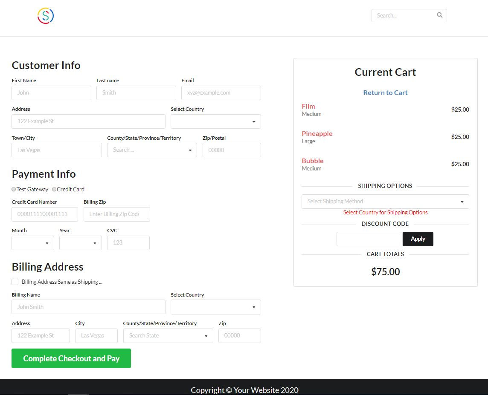

## Overview
You now have come to an important part of the eCommerce journey - payment processing and capturing an order.  And just a quick recap: we added some products to the Chec Dashboard and listed them on our site, we were then able to add chosen products to the cart, and now we want those items in the cart to be processed - get customer information and finalize payment; all with Commerce.js and the SDK.  The order will then be added to your Chec dashboard along with customer info and other important information.  There's a lot of information packed into this guide, so let's dive in!   

#### This guide will cover: 

1. Create new shipping zone & add zone to product 
2. Add checkout button & setup route to checkout form 
3. Create Form
4. Handling Form Data/Validation/Errors 
5. Handling Discount Code
6. Capturing Checkout
7. Route to conformation page (*Thanks for Your Order*)

##### ***** *Extra* *****
8. How to implement Stripe as a payment gatway
*******
*This guide strictly utilizes functional react components and relies heavenly on react hooks and dynamic rendering.  The purpose of this guide is to show how you can use the SDK to build eCommerce functionality and not a true deep dive into react. There will be links to outside resources that can further explain certain react features.*

### Requirements/Prerequisites

- [ ] IDE of your choice (code editor)
- [ ] [NodeJS](https://nodejs.org/en/), or [yarn](https://classic.yarnpkg.com/en/docs/install/#windows-stable) → npm or yarn.
- [ ] Some knowledge of Javascript & React
- [ ] *Bonus* - Using [React Hooks](https://reactjs.org/docs/hooks-reference.html) - specifically `useState()`, `useEffect()`, `useContext()`
- [ ] *Bonus* - familiarity with [React Router](https://reacttraining.com/react-router/web/api/Route)
- [ ] *Bonus* - familiarity with [React Hook Form](https://react-hook-form.com/api/)
- [ ] *Bonus* - familiarity with [Stripe](https://stripe.com/docs)
- [ ] *Bonus* - familiarity with the framework [Semantic UI (react) library](https://react.semantic-ui.com/)

## Getting Started

### STEP 1. Creating Shipping Zone & Adding to Product:

One of the most important steps to capturing an order is determining the logistics of how you will ship your products.  You need to answer questions like: Where will I ship? How much will I charge? Will it be a flat fee to place A etc...

For this example, we will have 3 shipping zones: United States, Mexico, Canada.  I will be charging a flat rate (see below) for each zone and in order to set this up, you must navigate to the ***Shipping Tab*** within your setup and click **Add Zone**

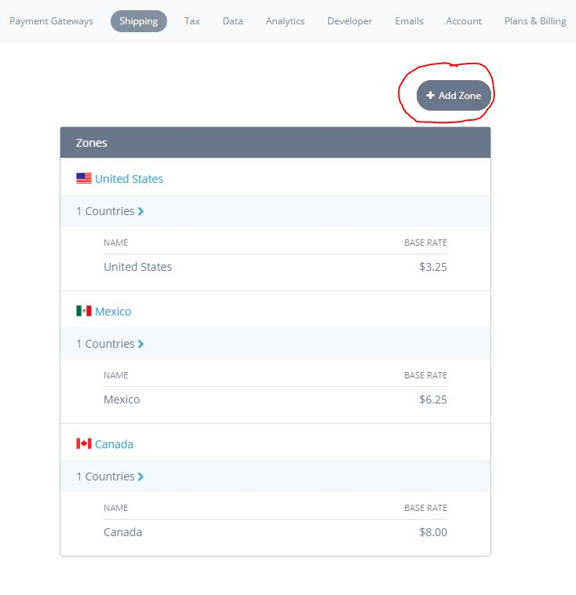

Now that I've added the shipping zones I wish to ship to, including price - I must further add these zones to my product.  Each product can have different shipping zones but for simplicity I'm going to add all three zones to every product in the catalog. 

#### Add Zone to Product

Navigate to each individual product and click the enable zone button.  This is will enable a particular shipping option for the product.  You can also add any extra shipping cost such as an amount for one order vs multiple.  

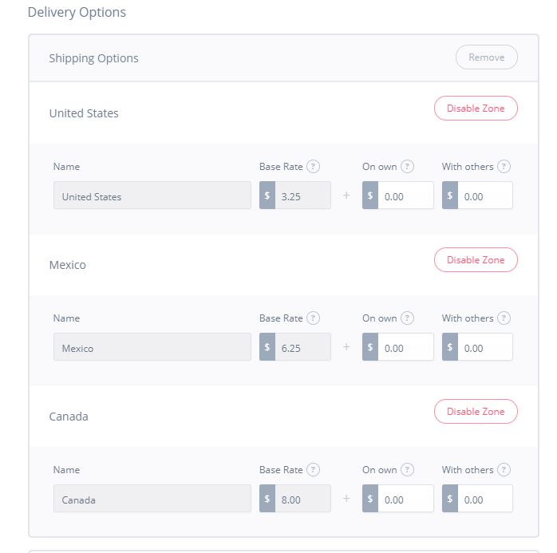

This is an important step and must be completed before you can capture a checkout. As you will see further in this guide, the shipping option is needed for Chec to process and finalize an order. You also want to give customers a shipping price so they have a total amount due. In our checkout form, once the customer chooses their country – the shipping options available for that country will be presented.  

### Step 2. Add Checkout Button & Setup Route to Form


The next thing we need to do is add a checkout button to the cart modal where all our products are listed.  Adding the button is pretty straight forward, but this button will have an `onClick` which will call a function with a few triggers - one of them is routing to our checkout form.  

```javascript
// *** CartModal.js ***
<Button 
    floated='left' 
    size='big' 
    color='blue' 
    onClick={goToCheckout}
>
    Checkout
</Button>
```

```javascript
// *** CartModal.js ***
const goToCheckout = e => {
    history.push(`/checkout/${props.cart.id}`)
    localStorage.setItem('cart-id', props.cart.id)
    props.setModalOpen(false)
    props.setCheckout(true)
}
```

React Router has a history object that we use here to 'push' the customer to the page of our choice.  In this case to the checkout page.  I'm also adding the `cart_id` to the URL.  The `cart_id` is needed data for important SDK helper function calls, so adding it the URL makes it easy to access in the next component.  

I'm also added the `cart-id` to local storage as trigger for the private route. Basically if there's no `cart-id` in local storage - you can't route to this page.  `props.setModalOpen(false)` is the trigger to close the modal and `props.setCheckout(true)` is the trigger to NOT show the cart icon in the Nav (*we want to hide icon during checkout*). 

#### Setting up your Route

As previously mentioned, this is not a deep dive into React or React Router, but here's an overview on setting up some routes.  First you need to install the proper dependencies `react-router` & `react-router-dom`.  In the index.js file you need to import the BrowserRouter: 

```javascript
// *** index.js ***
import { BrowserRouter as Router } from "react-router-dom";

ReactDOM.render(
    <Router>
        <App />
    </Router>
,document.getElementById('root'));
```

I'm wrapping the `<Router>` component around the `<App />` component so everything in our `<App />` component can access any routes I setup.  All the routes for your app will be setup in the `App />` component.  If you take a look in the `App.js` you'll notice a `Route` import: 

```
import { Route } from 'react-router-dom'
```

This component will be used to render our component based on a few properties ... 

```javascript
// *** App.js ***
<PrivateRoute 
    component={CheckoutContainer}
    path={`/checkout/:id`} 
    setCheckout={setCheckout}
    setModalOpen={setModalOpen}
    setReceipt={setReceipt}
/>
```

*** *Note *** `<PrivateRoute />` (**check PrivateRoute.js**) is a High Order Component created as sort of a middleware to allow logic to determine where a cutomer is routed*

You will notice the [component prop](https://reacttraining.com/react-router/web/api/Route/component) which is set equal to the component that needs to rendered.  The path is what the URL will be for this route and the rest of the props are needed to be passed along to be used in the `<CheckoutContainer />` component.  Here's another route setup for our homepage:

```javascript
c
<Route exact path="/" render={props => {
    return (
        <ProductContainer 
            {...props}
            addToCart={addToCart}
            setCheckout={setCheckout}
        />
    )
}}/>
```
Because this isn't a '*Private Route*' I use the [render prop](https://reacttraining.com/react-router/web/api/Route/render-func) which takes a function and returns your component.  So anytime a customer hits the home page, they will be routed to our `<ProductContainer />` component (*component that is listing our products*).  

If you recall for the checkout button we pushed the customer to this path: 
```
history.push(`/checkout/${props.cart.id}`)
```
And in our App.js, we have route setup to that exact path: 
```
<PrivateRoute 
    component={CheckoutContainer}
    path={`/checkout/:id`} 
```

the `:id` is just a foo name that is a variable for whatever text you put there.  In our case we're setting `props.cart.id` equal to `:id`.  This can later be accessed on the [match object](https://reacttraining.com/react-router/web/api/match) - `props.match.params.id`


Now that our routes are setup - it is time to build our form! 

### Step 3. Create Form

Before you create your form, it's good to determine what data is needed in order to process an order.  There are four main properties needed: **Customer** (*name, email etc...*), **Shipping** (*address, country etc...*), **Payment** (*card info, payment gateway*), **Fulfillment** (*whatever shipping method was selected*). Head over to the [docs](https://commercejs.com/docs/examples/capture-checkout.html) to get a better look at the final object you'll be sending to the Chec dashboard.   

*** *Note *** There's also **Billing** but it holds the same 'sub-properties' as Shipping - so I have logic setup to only include **Billing** if the customer's billing address is different than thier shipping.*

Each main property is an object which contains more properties 'sub-properties' of data that needs to be collected.  Take a look! 

```
customer: {
    firstname: 'Van',                   
    lastname: 'Williams',
    email: 'van.doe@example.com',
  },
  shipping: {
    name: 'Van Williams',
    street: '123 Fake St',
    town_city: 'Nashville',
    county_state: 'TN',
    postal_zip_code: '94103',
    country: 'US',
  }
```
I will be building my form using [Semantic UI](https://react.semantic-ui.com/collections/form/) components instead of the standard `<input />` element.  It is essentially the same implementation except you will see extra properties specific to the custom component provided by Semantic UI.  Let's look at each main property: 

#### Customer


```javascript
// *** CheckoutForm.js ***
<Form.Input
    fluid
    name="firstname" 
    label='First Name'
    placeholder='John'
/>
<Form.Input 
    fluid 
    name='lastname' 
    label='Last name' 
    placeholder='Smith'
/>
<Form.Input 
    fluid 
    name='email'
    label='Email' 
    placeholder='xyz@example.com'
    type='email'  
/>
```

As you can see, the properties are the same like `name`, `placeholder` that you would use for a normal `<input />` element.  

#### Shipping


```javascript
// *** CheckoutForm.js ***
<Form.Group>
    <Form.Input 
        width={10} 
        name='street' 
        label='Address' 
        placeholder='122 Example St'   
    />
    <Form.Select
        width={6} 
        name='country' 
        label='Select Country' 
        options={countries}
    />
</Form.Group>
<Form.Group>
    <Form.Input 
        width={6} 
        name='town_city' 
        label='Town/City' 
        placeholder='Las Vegas' 
    />
    <Form.Select
        width={6} 
        label='County/State/Province/Territory' 
        placeholder='Search ...'
        name='county_state' 
        search 
        fluid
        options={getCountryInfoShipping()}
    />
    <Form.Input
        width={4} 
        type='number'
        name='postal_zip_code' 
        label='Zip/Postal' 
        placeholder='00000'
    />
</Form.Group>
```

For [dropdowns](https://react.semantic-ui.com/modules/dropdown/#types-search-selection-two) in Semantic UI there's an options prop that takes an array of objects of different options a customer can choose.  

```
// *** Countries.js ***

export const countries = [
    {
    value: "CA",
    text: "Canada"
    },
    {
    value: "MX",
    text: "Mexico"
    },
    {
    value: "US",
    text: "United States"
    }
]
```

As the store owner and for this example we already set up shipping for only three countries.  These will be the only choices a customer can choose in order to ship.  Once a customer chooses thier country it will trigger a different set of options based on that country.  In order to achieve this I compiled a list of all territories/states/provinces for each country (*see the North America folder under utils*).    

So, the options property for this dropdown ... 

```
// *** CheckoutForm.js ***

<Form.Select
    width={6} 
    label='County/State/Province/Territory' 
    placeholder='Search ...'
    name='county_state' 
    search 
    fluid
    options={getCountryInfoShipping()}
/>
```
is set to a function - this function checks what Country was selected and returns the proper array for that country: 

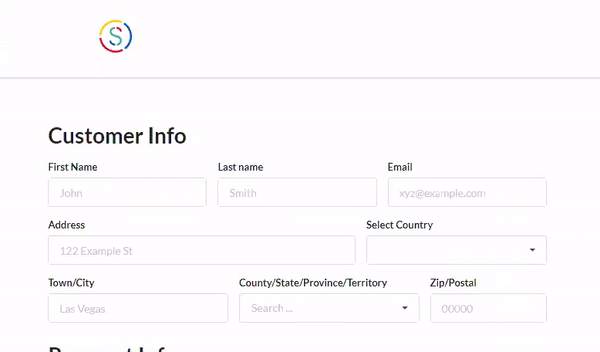

```
// *** CheckoutForm.js ***

const getCountryInfoShipping = () => {

    /* *** Gives user proper options based on Shipping Country *** */
    
    if (shipCountry === 'MX') {
        return mexico
    }

    if (shipCountry === 'CA') {
        return canada
    }

    if (shipCountry === 'US') {
        return stateOptions
    }
}
```

#### Payment

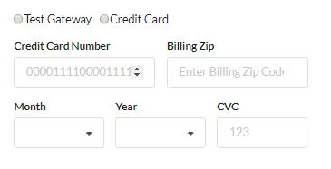

```javascript
// *** CheckoutForm.js ***
<Form.Group className='payment-radio'>
    <input
        name='gateway' 
        type='radio'
        value='test_gateway'
    />
    <label htmlFor="test_gateway">Test Gateway</label>
    <input
        name='gateway' 
        type='radio'
        value='stripe'
    />
    <label htmlFor="stripe">Credit Card</label>
</Form.Group>
<Form.Group>
    <Form.Input
        name='number'
        type='number' 
        label='Credit Card Number' 
        placeholder='0000111100001111' 
    />
    <Form.Input
        name='postal_billing_zip_code' 
        type='number'
        max='99999'
        label='Billing Zip' 
        placeholder='Enter Billing Zip Code'
    />
</Form.Group>
<Form.Group>
    <Form.Select 
        width={3} 
        name='expiry_month' 
        fluid 
        options={monthOptions} 
        label='Month' 
    />
    <Form.Select 
        width={3} 
        name='expiry_year' 
        fluid 
        options={yearOptions} 
        label='Year' 
    />
    <Form.Input 
        width={3} 
        name='cvc'
        type='number'
        label='CVC' 
        placeholder='123'
    />
</Form.Group>
```

These are all the fields needed to collect information about payment.  I had to bring in arrays (`monthOptions`, `yearOptions`) for the options props in regards to month/year card expiration.  

#### Fufillment


This is the last important piece of data you need to complete a checkout.  The customer needs to be able to select a shipping option.  The shipping option is determined by country - remember our shipping zones.  

**For example:** If the customer chooses Canada as their shipping country, then we run a function with that country code in order to give a shipping option to choose from.  This option determines the price for shipping to your country. For this store - I'm charging $8 dollars flate rate to ship to Canada.

Because I've separated the shipping options from the main form (*where I'm gathering all the other data*), I have to pass a function via props to our form.  This function is wrapped in a `useEffect()` and gets triggered every time a different country is selected.  

```
useEffect(() => {
    // *** CheckoutForm.js ***

    /* *** Takes the Shipping Country and updates shipping Options *** */
    props.getShippingOptions(shipCountry)
}, [shipCountry])
```

Let's take a look at the `getShippingOptions()` function: 

```javascript
// *** CheckoutContainer.js ***
const getShippingOptions = (countrySymbol) => {

    /* 
    Getting the Customer's Shipping Options based on the Country
    Function is triggered once user selects country in CheckoutForm. 
    */

    if (countrySymbol) {
        commerce.checkout.getShippingOptions(tokenId, {
            country: countrySymbol
        })
            .then(res => {
                // console.log(res, 'res from getting Shipping options by country')
                let shippingOptionsArray = res.map(option => {
                    let shInfo = {}

                    shInfo.key = countrySymbol
                    shInfo.text = `${option.description}(${option.price.formatted_with_code})`
                    shInfo.value = option.id
        
                    return shInfo
                })
                setShippingOptions(shippingOptionsArray)
            })
            .catch(err => console.log(err))
    }
}
```

This function is using the `commerce.checkout.getShippingOptions()` [helper function](https://commercejs.com/docs/overview/getting-started.html) to go and retrieve the shipping option based on the country symbol (*I pass that data in as an argument*).  The response is an array of shipping options and I'm mapping over that array in order to format the data that gets passed to the options property in the selection dropdown element. I then put that array into state for later consumption. 

Here's a look at the code for the dropdown: 

```
<Dropdown
    placeholder='Select Shipping Method'
    fluid
    selection
    options={shippingOptions}
    onChange={handleDropDownShipping}
/>
```

The last part is that I want to apply the shipping option to the cart total and update the total cost.  The Commerce.js SDK makes this easy because they provide a function that when given a shipping option and a checkout token, you get back an updated live object.  All you have to do is update state with the new live object and all of the data depending on that object will get updated.  

```javascript
// *** CheckoutContainer.js ***

const handleDropDownShipping = (e, {value, options}) => { 
        
    /* 
    Applies shipping option to Cart Total
    Updates Live Object in state 
    */

    commerce.checkout.checkShippingOption(tokenId, {
        id: value,
        country: options[0].key
    })
        .then(res => {  
            // console.log(res, 'res from checking discount code')
            setShipOption(value)
            setLiveObject(res.live) 
        })
        .catch(err => console.log(err))

}
```

As you can see I'm using `commerce.checkout.checkShippingOption()` helper function and passing it the checkout token and an object with the `shipping_option_id` and `country`.  As mentioned the response contains an updated live object so I update state and also set the `shipping_option_id` - (`setShipOption(value)`) in state so that info can be sent to Chec dashboard when we finally capture the checkout.  

Yay! We have built our form and made sure we have all the fields necessary to capture an order.  We also confirmed that whenever a customer selects a country, they are then able to apply a shipping option to the total cost.  Now it's time handle all the data. 

### Step 4. Handling Form Data/Validation/Errors

Typically speaking at this point you would need to apply some `onChange` events to each of our inputs and dropdowns.  You then build a function that takes the input data and stores it into state.  After that you would probable write an `onSubmit` function to grab all the data in state and finally do something with it.  Within your `onSubmit` function is where you would handle errors and things of that nature.  

We are going to make our programming lives easier by using a third party library called [React Hook Form](https://react-hook-form.com/api/).  This is a form validation and form error handling library that makes the handling of data much easier.  When configured properly you don't have to apply change handler functions to each input and manually program errors in the event field data is missing.  

This is very important for UX (user experience) that the customer is informed visually if they left something blank or typed something incorrectly. I want to apply as much data validation as possible before sending data to be processed by Chec dashboard.  When programming our `onSubmit`function we know the data coming in has been validated.  

Let's add the dependency `npm install react-hook-form` or `yarn add react-hook-form`.  I will now bring in a component and a hook from the library: 

```
import { useForm, Controller } from 'react-hook-form'
```

*** *Note *** The power of this library is quite intense and this guide by no means explains this libarary in detail.  You may find another library for validation better such as formik or yup.  But this is a lightweight simple option for what we need to accomplish.*  

In order to configure everything properly we need to wrap our input elements with the `<Controller />`  component from `react-hook-form`.  We also will use a few helpful properties from within the `useForm()` hook: 

```
const { register, handleSubmit, errors, control, reset } = useForm()
```

[These properties and how they work further explained](https://react-hook-form.com/api#useForm) 

Let's take a look at some inputs to see how we configured them using `react-hook-form`: 

```javascript
// *** CheckoutForm.js ***
<Controller
    fluid
    id='customer' 
    name="firstname" 
    label='First Name'
    placeholder='John'
    control={control}
    as={Form.Input} 
    rules={{ required: "Please enter Firstname" }}
    error={errors.firstname && errors.firstname.message} 
/>
```

Our input for getting firstname data now looks like this.  I used the `<Controller />` component from the library along with a few extra props.  The rules prop allows me to set rules for this input.  It takes an object with a property `required`.  It sets this input to be required and if left empty, an error gets added to the errors object based on the name.  Semantic UI has an error prop we can add and easily attach errors to any field left empty. 


All the dropdown inputs will work slightly different in that need we to attach an `onChange` property that returns the selected option: 

```javascript
// *** CheckoutForm.js ***
<Controller
    fluid
    search 
    width={6} 
    label='County/State/Province/Territory' 
    placeholder='Search ...'
    name='county_state' 
    options={getCountryInfoShipping()}
    as={Form.Select}
    control={control}
    rules={{ required: "Must Select Country First" }}
    error={errors.county_state && errors.county_state.message} 
    onChange={(e) => e[1].value}
/>
```

It's a similiar process except we have the `onChange` that returns the value selected.

#### The `handleSubmit()` function

So we've wired up each input using our third party `react-hook-form` and made sure all the errors work properly.  Here comes the real power within the library if you recall the handleSubmit property that was brought in from the `useForm()` hook: 

```
const { register, **handleSubmit**, errors, control, reset } = useForm()
```

I will now pass my `onSubmit` function to the `react-hook-form`'s `handleSubmit()`: 

```
<Form className='checkout-form' onSubmit={handleSubmit(onSubmit)} loading={processing}>
```

Let's take a look at our function that we're passing to `handleSubmit()`. 

```
const onSubmit = (data) => {
    console.log(data)
}
```

As you can see there's an argument `data` that we will log and get some eyes on what is passed to our function.  You'll notice that all of our form data has been set as the value and each name set as the key.  

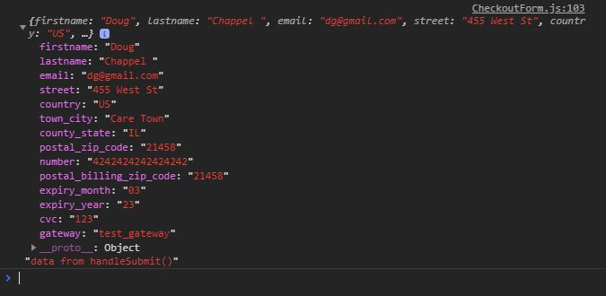

We have all our data from the form!  The convenient part is that this function never runs unless all input meets validation.  I set required to all inputs so this function ONLY runs if nothing is left blank.  All that is left is formatting the data properly to match how the Commerce.js SDK will process our data.  

### Step. 5 Handling Discount Code


<!-- ```javascript
// *** ProductCard.js ***

    useEffect(() => {        
        
        let finalSizeArray = props.product.variants[0].options.map(option => {
            let sizeInfo = {}

            sizeInfo.key = option.name
            sizeInfo.text = option.name
            sizeInfo.value = option.id

            return sizeInfo
        })

        setSizes(finalSizeArray)
    }, [])
```

The purpose of the `useEffect()` here is that our `<Dropdown />` Semantic UI component needs options to select.  The `useEffect()` allows us to map through our variant options and create our options array before the render.  It's important to note I set the value to the option.id because that is data needed to add a product (and it's variant) to the cart.  Once complete, we add that value to state so our `<Dropdown />`  component can then access it.  

```
const [sizes, setSizes] = useState([])
```

This is how our Product Card looks once we add our dropdown: 

```javascript
// *** ProductCard.js ***

<Card>
    <Image src={props.product.media.source} />
    <Card.Content>
        <Card.Header>{props.product.name}</Card.Header>
        <Card.Meta>{props.product.price.formatted_with_symbol}</Card.Meta>
        <Card.Description>{props.product.description.replace(/(<([^>]+)>)/ig,"")}</Card.Description>
        <Dropdown
            className="sizes-drop"
            onChange={handleSize}
            value={sizes.text}
            fluid
            placeholder='Select Size'
            selection
            options={sizes}
        />
    </Card.Content>
</Card>
```

Now it's time to write the ***onChange*** function `handleSize()` that will capture the selection and put that data into state: 

```javascript
// *** ProductCard.js ***

const [variantInfo, setVariantInfo] = useState()

const handleSize = (e, {value}) => {
    setVariantInfo({[props.product.variants[0].id]: value})
}
```

This function creates an object that matches the proper format for sending variant info using the `cart.add()` method from the SDK. 
```
 { vrnt_RyWOwmPO9lnEa2: 'optn_zkK6oLpvEoXn0Q' }
 ```

 We now have an object variable (`variantInfo`) that contains the variantID along with the selected variant optionID.  


### STEP 2. Addding Product to Cart:

This is where the fun begins! Just a point of note, you're going to see a pattern emerge where we add an action button - write a function to handle said action, then pass that function to the component that needs it.  But before we do any of that, we need to setup the state that will be holding our cart object for the entire app.  

```
// *** App.js ***

const [cart, setCart] = useState()
```

There are many ways to handle state management, which also includes organization.  For our example we will be putting our 'global state' (***state that needs accessed across many components***) inside our `<App />` component.  For shallow nested components we will prop drill - for the deeply nested components we will use the [`useContext()` API](https://reactjs.org/docs/hooks-reference.html#usecontext).  

Let's write our `addToCart()` function that will take two args - a ***productId*** and the ***variantInfo*** variable we talked about earlier:  

```javascript
// *** App.js ***

const addToCart = (productId, variantInfo) => {

    if(variantInfo) {
        commerce.cart.add(productId, 1, variantInfo)
            .then(res => {
                setCart(res.cart)
            })
    } else {
        window.alert('Please Select a Shirt Size')
    }
}
```

We have some logic to make sure the user selects a variant (*it's required to select a variant in order to add it to the cart*). We also hard-code the quantity to 1 because our cart page is where a customer can change the quantity. Lastly upon a successful response we'll add the cart object to our global cart state. 

#### Utilization of `cart.retrieve()`

This is a very important method because when called it returns your most up to date cart info.  We want to use this method in our `<App />` component to always be checking for the latest cart data.  As you will see, this also helps us with data persistence in the event of a refresh or re-render.   

```javascript
// *** App.js ***

useEffect(() => {
    commerce.cart.retrieve()
        .then(res => {
            setCart(res)
        })
},[])
```

Let's take a look at our `<App />` component with all the updates: 

```javascript
// *** App.js ***

function App() {

    const commerce = new Commerce(process.env.REACT_APP_PUBLICKEY_SANDBOX)

    const [cart, setCart] = useState()

    useEffect(() => {
        commerce.cart.retrieve()
            .then(res => {
                setCart(res)
            })
    },[])

    const addToCart = (productId, variantInfo) => {

        if(variantInfo) {
            commerce.cart.add(productId, 1, variantInfo)
                .then(res => {
                    setCart(res.cart)
                })
        } else {
            window.alert('Please Select a Shirt Size')
        }
    }

    return (
        <div className="App">
            <Nav cart={cart} emptyCart={emptyCart}/>
            <Grid centered stackable padded relaxed>
                <Grid.Column className='left-column' width={5}>
                    <LeftPanel />
                </Grid.Column>
                <Grid.Column width={9}>
                    <ProductContainer 
                        addToCart={addToCart} 
                    />
                </Grid.Column>
            </Grid>
            <Footer />
        </div>
  );
}
```

We have our `cart.retrieve()` always making sure our cart object is up to date, our `addToCart()` function that is being passed to our `<ProductContainer />` component -  which will then be passed to our `<ProductCard />` component.  

#### Add to Cart Button

Now that we have everything setup in our `<App />` and have also passed the `addToCart()` function to the proper component - we need to create a button that will trigger our function and add the product (and its variant) to the cart, and also update our state cart object. 

```javascript
// *** ProductCard.js ***

const handleButtonAddCart = e => {
    e.preventDefault()
    props.addToCart(props.product.id, variantInfo)
}

<Button fluid className='add-button' onClick={handleButtonAddCart}>
    Add to Cart
    <Icon name='arrow right' />
</Button>
```

As you can see we call our `addToCart()` function with the two required args which then runs and executes letting us know a product has been added to our cart! 

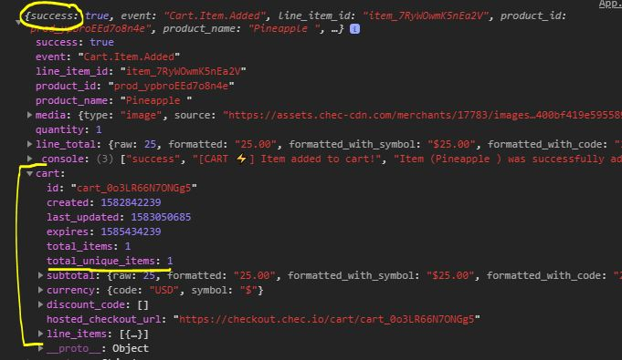

### STEP 3. Add Cart Notification:

Once we've added an item/product to the cart, we need to let the user know something has been added to the cart.  This can be done in many ways: you can give a message, pop up a modal etc... In our case we will changing the cart Icon from the normal black color to a green color with a number associated with the amount of items in the cart.  

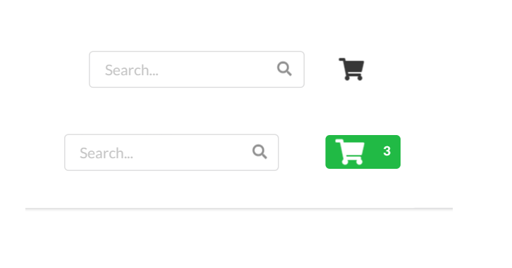

#### Display for Empty Cart

When the cart is empty as mentioned we only want to show the black cart icon, and when you click the cart we want to show an empty cart. For this example our cart page will be a modal.  Once clicked a modal will pop up saying our cart is empty.  

This is accomplished by sending our cart object from state to our `<Nav />` component.  
```javascript
// *** App.js ***

<Nav cart={cart} emptyCart={emptyCart}/>
```

The cart object has all the necessary data required to display what's needed to the user.  And, if you recall because we're updating our cart object in state whenever there are changes, we can attach key data to our cart object and ensure that the cart information is correct.

Here's a look at the cart object with key data points underlined ... 


This is one of the best benefits of the Commerce.js SDK is that we can tie the `total_unique_items` property to our cart icon to either show a number or the plain black cart.  

```javascript
// *** Nav.js ***

const iconDisplay = () => {

    if (props.cart && props.cart.total_unique_items > 0) {
        return(
            <Label color='green' >
                <Icon name='shopping cart' size='big'/>
                {props.cart.total_unique_items}
            </Label>
        )
    } else {
        return (
            <Icon name='shopping cart' size='large'/>
        )
    }
}
```

We have a function here that returns some JSX depending on the value of `props.cart.total_unique_items`.  Semantic UI (react) has a `<Modal />` component that we will use to display our cart modal.  There's a trigger attribute that takes a JSX element that when clicked will pop up the modal.  We now just pass our `iconDisplay()` function to the trigger.  

```javascript
// *** Nav.js ***

<Modal trigger={iconDisplay()} className='cart-model' closeIcon>
    <CartModal cart={props.cart} />
</Modal>
```

As you can see we're also passing the cart object as a prop to our `<CartModal />` component that will be used later to display any items/products that are in the cart.  In our `<CartModal />` component we will have more logic based on the value of `props.cart.total_unique_items`.  

*It's important to distinct between `total_items` and `total_unique_items`, we only care about the ***unique*** items because those are the items that get displayed.*

Let's take a look at our `<CartModal />` component and setup what will get displayed if the `total_unique_items` is zero: 

```javascript
// *** CartModal.js ***

{props.cart && props.cart.total_unique_items > 0 ? (
    <>
        //This is what we will display if there are any items/products 
        //in our cart
    </>
) 
:
(
    // This is our Modal when there are ZERO items/products in our cart

    <>
        <Modal.Header>Seities Apparel Cart</Modal.Header>
        <Modal.Content image>
            <Image wrapped size='huge' src={cartImg} />
            <Modal.Description>
                <Header>Your Cart is currently Empty</Header>
                <p>
                    It would make you very happy if you added an item to the cart
                </p>
            </Modal.Description>
        </Modal.Content>
    </>
)}
```


### STEP 4. Listing Items/Products in Cart:

Now it's time to add code so that we can display any items/products in our cart.  We will create another component `<CartItems />` that will be used to render our data.  If you recall we've been passing our cart object in state - but for OUR items, we only need data about each item.  The Commerce.js SDK wonderfully provides all necessary data within the `line_items` property.  Take a look: 

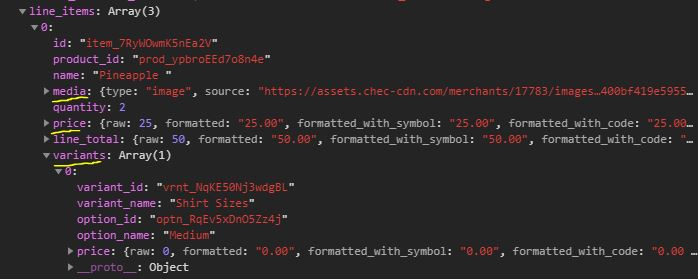

In order to make sure we're listing all items in our cart we need to map over the `line_items` property and send each `item` down to our `<CartItems />` component. 

```javascript
// *** CartModal.js ***

{props.cart && props.cart.total_unique_items > 0 ? (
    <>
        <Item.Group divided>
            {props.cart.line_items.map(item => (
                <Item key={item.id}>
                    <CartItems item={item}/>
                </Item>
            ))}
        </Item.Group>
    </>
)
```

Now that we have gone a level deeper in our cart object (`line_items`) - within our `<CartItems />` component we can access data associated with each item.  

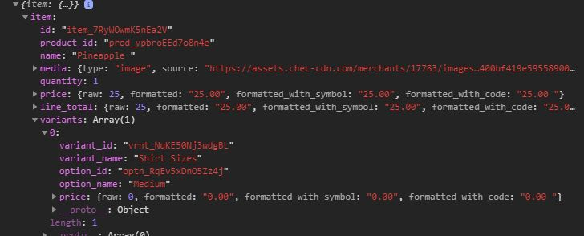

Let's take a look at our `<CartItems />` component and see how we're displaying and rendering item information: 

```javascript
return (
    // *** CartItems.js ***

    <>
        <Item.Image size='tiny' src={props.item.media.source} />
        <Item.Content verticalAlign='middle'>
            <Item.Header>{props.item.name}</Item.Header>
            <Item.Meta>
                <span>{props.item.variants[0].option_name}</span>
            </Item.Meta>
            <Item.Extra className='item-total'>
                <Header floated='right'>${props.item.line_total.formatted_with_symbol}</Header>
            </Item.Extra>
        </Item.Content>
    </>
);
```

As you can see we're just grabbing the necessary data from the props object that correlates to traditional data you will see when looking at shopping cart on an eCommerce website.  

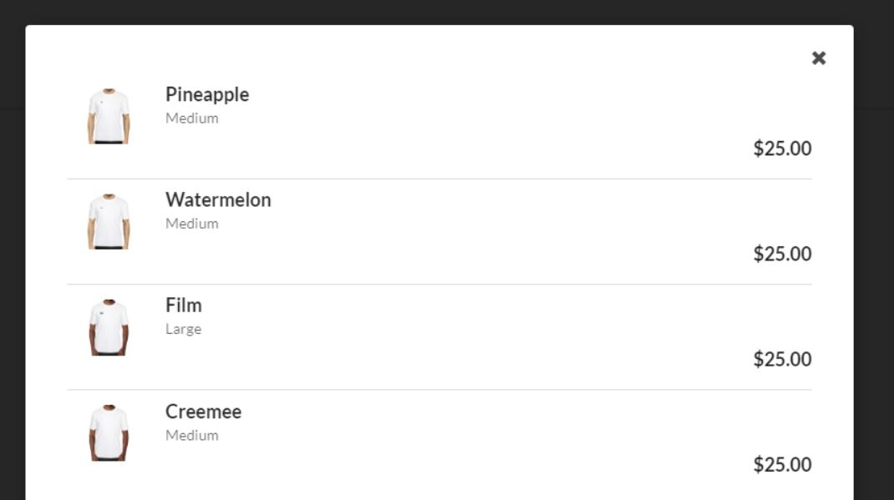

### STEP 5. Add Empty Cart Button:

Now that we have our cart logic complete and rendering our items, let's add a button that will be used to empty our entire cart! For this we will reference our pattern: 

> we add an action button - write a function to handle said action, then pass that function to the component that needs it

#### Add Action Button
    
The user only needs to empty the cart if there are items present - so we will be adding our button in the same place that we're mapping over the `line_items` property.  

```javascript
// *** CartModal.js ***

{props.cart && props.cart.total_unique_items > 0 ? (
    <>
        <Item.Group divided>
            {props.cart.line_items.map(item => (
                <Item key={item.id}>
                    <CartItems item={item}/>
                </Item>
            ))}
        </Item.Group>

        <Modal.Actions className='model-bottom'>
            <Button  
                basic 
                negative  
                floated='left' 
            >
                Empty Cart
            </Button>
            <Header floated='right'>{props.cart.subtotal.formatted_with_symbol}</Header>
        </Modal.Actions>
    </>
)
```

#### Function to handle action (empty cart)

Now we write our function in the same place where our cart object in state is located, which in our example is in the `<App />` component.  Because this is a shallow nest, we will send our function via props to the `<CartModal />` component. 

```javascript
// *** App.js ***

const emptyCart = () => {
    commerce.cart.empty()
        .then(res => {
            setCart(null)
        })
}

//Passing function as prop App -> Nav
<Nav cart={cart} emptyCart={emptyCart} />
```

```javascript
// *** Nav.js *** Passing function as prop App -> Nav -> CartModal
<CartModal cart={props.cart} emptyCart={props.emptyCart} />
```

```javascript
// *** CartModal.js *** Adding function to handle click
<Button  
    basic 
    negative  
    floated='left' 
    onClick={props.emptyCart}
>
```


This is why we want this function to live in the component where our cart object in state was created.  It makes it simple and easy to update state whenever there are any changes to the cart.  And because our state cart object is being shared across components - any updates to cart triggers a re-render.  This way our cart object is always up to date and our UI is connected to the data within the cart object. 

- *You will notice we're setting our cart object to `null`. Based on how your logic is setup this could be an empty array `[]` or `undefined` ect... - this will be up to you and how you might set things up.  Because our <App /> component is retrieving a new cart each render or refresh, `null` will be overwritten.*   

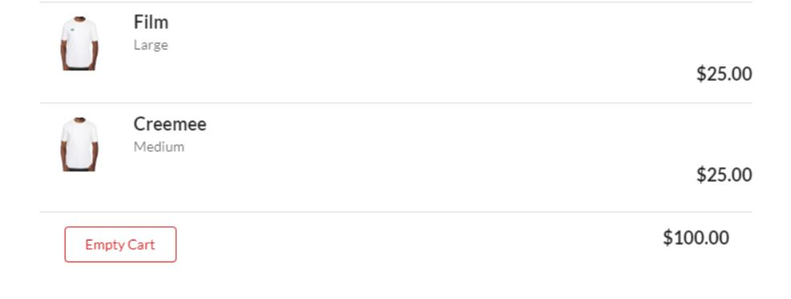

### STEP 6. Add Functionality to Increase/Decrease Quanity:

Lastly, it's time to add the capability to increase/descrease the item quanity.  This is important to allow customers to adjust quanity before checkout.  Again, let's reference our pattern once more! 

> add an action button - write a function to handle said action, then pass that function to the component that needs it

#### Let's add the necessary buttons ... 

Our buttons will be added in our `<CartItems />` component. There are many ways to present this feature, but in our example will have three elements: 
- Minus button
- Input
- Add button

```javascript
    // *** CartItems.js ***

return (
    <>
        <Item.Image size='tiny' src={props.item.media.source} />
        <Item.Content verticalAlign='middle'>
            <Item.Header>{props.item.name}</Item.Header>
            <Item.Meta>
                <span>{props.item.variants[0].option_name}</span>
            </Item.Meta>

            // New Added Elements
            <div className='quanity-group'>
                <Button
                    negative 
                    className='quan-buttons' 
                > 
                    <Icon name='minus' /> 
                </Button>
                <Input 
                    className='input-quanity'
                    value={props.item.quantity} 
                />
                <Button
                    positive 
                    className='quan-buttons'
                > 
                    <Icon name='plus' /> 
                </Button>
            </div>
            <Item.Extra className='item-total'>
                <Header floated='right'>${props.item.line_total.formatted_with_symbol}</Header>
            </Item.Extra>
        </Item.Content>
    </>
);
```

As you can see because we hardcoded the initial quanity, we just bring that value from props and set that as the input value. 

``` javascript
// *** CartItems.js ***

<Input 
    className='input-quanity'
    value={props.item.quantity} 
/>
```
Another important addition is the `line_total` which correlates to the total amount based on quanity.  

```javascript
// *** CartItems.js ***

<Item.Extra className='item-total'>
    <Header floated='right'>${props.item.line_total.formatted_with_symbol}</Header>
</Item.Extra>
```
Here's a look at our cart once our new elements have been added: 


#### Creating Functions for each action

Now that we have our buttons displaying properly, let's write the functions utilizing the Commerce.js SDK cart methods.  As mentioned we want to write these functions in the `<App />` component where our cart object in state lives. 

```javascript
// *** App.js ***

const cartHelperFunctions = {

    deleteItem: (lineItemId) => {
        commerce.cart.remove(lineItemId)
            .then(res => {
                setCart(res.cart)
            })
    },
    addQaunity: (lineItemId, newQuanity) => {
        commerce.cart.update(lineItemId, {quantity: newQuanity})
            .then(res => {
                setCart(res.cart)
                
            })
    },
    subtractQuanity: (lineItemId, newQuanity) => {

        if (newQuanity === 0) {
            cartHelperFunctions.deleteItem(lineItemId)
        } else {
            commerce.cart.update(lineItemId, {quantity: newQuanity})
                .then(res => {
                    setCart(res.cart)
                })
        }

    }
}
```

Since all these functions are being sent to the same component `<CartItems />` we create an object that will reference each function based on a particular key. Because of the Commerce.js SDK and the properties on the cart object, we have everything we need to call these [SDK cart methods](https://commercejs.com/docs/examples/add-to-cart.html).

We also have some extra logic in our `subtractQuanity()` function that checks if an user clicks the minus button to get to a quanity of zero.  In that case, we want to completely remove the item from our cart.  So we can just call our `deleteItem()` function along with the `lineItemId`.  

#### Passing down our functions... 

Because our `<CartItems />` component is deeply nested we're going to use a particular hook to help prevent massive prop drilling - `useContext()`.  

*Again, this is preference and NOT a guide on react hooks or prop drilling...*  

Moving forward, in order to use [Context API](https://reactjs.org/docs/hooks-reference.html#usecontext) - we need to setup our context and export it using `createContext()`: 

```
export const CartItemsContext = React.createContext()
```

Once created we can wrap our context provider component around the component that will need the functions.  This provider component takes a value attribute that will be set to the data needed within the component tree.  

The cool thing about the Context API is that whatever component is wrapped in the provider will have access to the value attribute - it acts as a broadcast to every nested component.  

```javascript
// *** App.js **

<CartItemsContext.Provider value={cartHelperFunctions}>
    <Nav cart={cart} emptyCart={emptyCart}/>
</CartItemsContext.Provider>
```

As you can see, we pass the `cartHelperFunctions` object as the value. 

Now in our `<CartItems />` component (which is deeply nested) we can access our functions by first importing our context and second, using the `useContext()` hook and initializing it with our context. 

```
// *** CartItems.js ***

import { CartItemsContext } from '../App'

const helpFnc = useContext(CartItemsContext)
```

All we need to do now is attach the proper function to an `onClick` for each button.  Further, because our data is being read from our cart object in state and the cart object is being updated with each action - our data will always reflect the correct information, how awesome!

```javascript
// *** CartItems.js ***

<div className='quanity-group'>
    <Button
        negative 
        className='quan-buttons' 
        onClick={() => {
            let newQuanity = props.item.quantity - 1
            helpFnc.subtractQuanity(props.item.id, newQuanity)
        }}
    > 
        <Icon name='minus' /> 
    </Button>
    <Input 
        className='input-quanity'
        value={props.item.quantity} 
    />
    <Button
        positive 
        className='quan-buttons'
        onClick={() => {
            let newQuanity = props.item.quantity + 1
            helpFnc.addQaunity(props.item.id, newQuanity)
        }}
    > 
        <Icon name='plus' /> 
    </Button>
</div>
```

We calcuate the `newQaunity` and pass that data along with the `item.id`.  Once complete you should have full cart functionaility! 


#### Conclusion 

Wheew! Let's take a step back and quickly summarize what we acommplished.  
- used the Chec Dashboard to add variants to our product
- setup global cart object and wrote function to add product to cart
- made sure visually the customer can be assured an item was added to the cart
- mapped over line items and listed the products in the cart
- wrote function to empty cart and added button
- wrote functions to increase/decrease quanity and added buttons 

Thanks to the Commerce.js SDK and all the usefull methods/functions that come with the commerce object - **updating/refreshing/adding** to your cart becomes straighforward and easy to manage.  You setup your global state for the cart and pass that data throughout your app.  

If you happen to be advanced in react you can implement redux for state managment and initialize your store with the cart object.  There are many ways to design and layout your eCommerce app - but the most important factor is getting the neccessary data in order to provide a smooth user experience when selecting a product and adding to the cart.  

This guide is a continuation of a previous guide:
 - [Listing Products in Catalog](https://github.com/kingmoc/product-list-cjs-react) - check that out if you're just starting out and need help with getting your products listed on the page.  

[LIVE DEMO](https://seities-store-cjs-react-guide.netlify.com/)

## Built With

* [React.Js](https://reactjs.org/docs/getting-started.html)
* [Semantic-UI](https://react.semantic-ui.com/)
* [Commerce.js (SDK)](https://commercejs.com/docs/) -->


